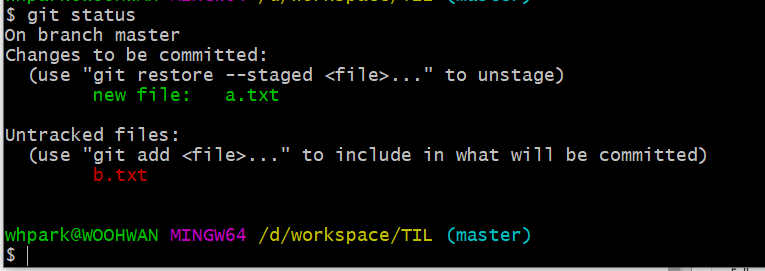

### git Command

> git  명령어 정리

##### 초기설정

----

1.init

- `git init`
- .git/ 폴더를 생성한다.

- .git 폴더가 생성된 경우 오른쪽에 `master`라는 표시가 나온다.
- 최초에 한 번만 한다

2.config

- `git config --global user.email "id@example.com"`
  - 이메일의 경우 github에 올릴 경우 잔디가 심어지는 기준이므로 정확하게 입력

1.add

> working directory에서 Staging 영역으로 이동

- `git add <file name>`
  - `git add . ` 현재 폴더의  수정된 파일

- - 

3.commit

- `git commit -m "메시지"
- 스냅샷을 찍는 동작
- add되어 있는 파일들을 하나의 묶음으로 저장
- 메시지가 들어가는 내용은 기능 단위로

4.remote

- `git remote add origin <주소>`

- 원격 저장소와 현재 로컬 저장소를 연결

  

5.push

- `git push origin master`
- 원격 저장소에 로컬 저장소의 데이터를 전송

6.status

- `git status`

  

- 추적해야 할 파일과 add는 했지만 commit이 필요한 파일들을 보여준다.